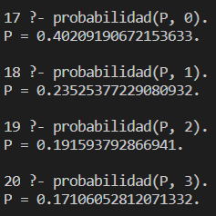
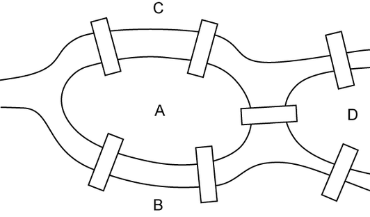
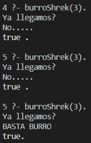

## Desafíos Café con Leche - Paradigma Lógico

https://docs.google.com/document/d/1z4FwlOZxNSNwFuWL04XsxxlrNsQkvAJsj2VM_03ctng/edit

---

#### TEG

##### Elaborar una consulta que permita calcular la probabilidad de ganar 3, 2, 1, y 0 ejércitos en el T.E.G. (contando solamente tiradas de 3 dados de parte de ambos jugadores).

Predicados auxiliares:
- dado/1, genera un dado (número entre 1 y 6).
- jugada/2, genera un functor tirada/3 con 3 dados ordenados de mayor a menor.
- pares/3, genera tres functores par/2 que funcionan como pares ordenados, formados por las componentes de mismo índice de dos tirada/3.  
Ej: tirada(3,3,2), tirada(6,1,1) -> par(3,6), par(3,1), par(2,1)
- punto/2, relaciona un par/2 con su puntaje (1 si la primera componente es mayor, 0 en otro caso).
- gana/1, puntaje de una jugada instanciada.
- probabilidad/2, relaciona un puntaje con su probabilidad, ejecutando dos findall/3 y calculando el cociente de dos listas: casos favorables y casos totales.

Para conocer el porcentaje de cada puntaje, se ejecutan las siguientes consultas:

El predicado dado/1 puede ser aleatorio, con un random(1,6,X), o puede generar todos los casos, con un member(X, [1,2,3,4,5,6]).
Usando la segunda opción y un predicado auxiliar obtenemos todos los casos posibles de tiradas:

> ?- todasLasJugadasPosibles(Lista, Longitud); true.
> w //esto se usa para que muestre la lista entera
> Lista = [tirada(1, 1, 1), tirada(2, 1, 1), tirada(3, 1, 1), tirada(4, 1, 1), tirada(5, 1, 1), tirada(6, 1, 1), tirada(2, 2, 1), tirada(3, 2, 1), tirada(4, 2, 1), tirada(5, 2, 1), tirada(6, 2, 1), tirada(3, 3, 1), tirada(4, 3, 1), tirada(5, 3, 1), tirada(6, 3, 1), tirada(4, 4, 1), tirada(5, 4, 1), tirada(6, 4, 1), tirada(5, 5, 1), tirada(6, 5, 1), tirada(6, 6, 1), tirada(2, 2, 2), tirada(3, 2, 2), tirada(4, 2, 2), tirada(5, 2, 2), tirada(6, 2, 2), tirada(3, 3, 2), tirada(4, 3, 2), tirada(5, 3, 2), tirada(6, 3, 2), tirada(4, 4, 2), tirada(5, 4, 2), tirada(6, 4, 2), tirada(5, 5, 2), tirada(6, 5, 2), tirada(6, 6, 2), tirada(3, 3, 3), tirada(4, 3, 3), tirada(5, 3, 3), tirada(6, 3, 3), tirada(4, 4, 3), tirada(5, 4, 3), tirada(6, 4, 3), tirada(5, 5, 3), tirada(6, 5, 3), tirada(6, 6, 3), tirada(4, 4, 4), tirada(5, 4, 4), tirada(6, 4, 4), tirada(5, 5, 4), tirada(6, 5, 4), tirada(6, 6, 4), tirada(5, 5, 5), tirada(6, 5, 5), tirada(6, 6, 5), tirada(6, 6, 6)],
Longitud = 56 .

#### Camino de Euler

##### Elaborar una consulta que permita saber si existe un camino de Euler para un grafo dado.

Propiedad utilizada:  
> Un grafo no dirigido tiene camino de Euler *sí y solo sí* tiene o bien 2 vértices con grado impar, o ninguno, y todos sus vértices pertenecen a una componente conexa.

Grafo de prueba: el famoso problema de los puentes de Königsberg:  
 height=300>

Hechos:
- arista/3, relaciona dos vértices con la arista que los une, p.ej.: arista(a,1,b).
- conectado/2, es verdadero si dos vértices tienen una arista que los une.
- camino/2, es verdadero si existe un camino entre dos vértices.
- grado/2, relaciona un vértice con su grado.
- existeEuler/0, es verdadero si existe camino de Euler en la base de conocimiento cargada.

Para esta aplicación alcanza con el predicado conectado/2 en adelante, arista/3 sólo se incluyó para tener una base de conocimiento completa en caso de querer hacer pruebas de fuerza bruta / lo que sea.

#### Insistencia

##### Elaborar una consulta que genere un resultado distinto después de realizarla una cantidad N de veces.

Predicados nativos de Prolog utilizados:
- read_file_to_codes/3, relaciona un nombre de archivo con una lista del código ASCII de cada carácter en su contenido, y una lista de opciones que dejé vacía para esta aplicación.
- open/3, relaciona un nombre de archivo y modo de uso con un flujo.
- read/2, relaciona un flujo con una línea leída.
- write/2, relaciona un flujo con información a escribírsele.
- write/1, es verdadero cuando escribe la información dada a la terminal.
- close/1, es verdadero cuando finaliza un flujo.

Utilizando el manejo de archivos, creé dos predicados:
- caracteres/1, es verdadero cuando el número de caracteres especificado coincide con los del archivo 'insistencia.txt'.
- agregar/1, es verdadero cuando agrega información dada al final del archivo 'insistencia.txt' (es como append).

Y finalmente, creé el predicado burroShrek/1 que es verdadero y muestra "Ya llegamos? nl No....." cuando la cantidad especificada es mayor a la cantidad de caracteres en 'insistencia.txt' y escribe un caracter a ese archivo, o es verdadero y muestra "Ya llegamos? nl BASTA BURRO" cuando la cantidad especificada es igual.

