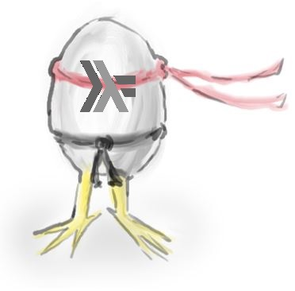

# Pollos Ninjas Espaciales Mutantes

## Ejercicios integrador - Paradigma Funcional


### Pollos 
Tenemos algunos pollos, de los cuales conocemos cómo se hacen llamar, los días que llevan vivos, su peso en gramos y una lista de aún no sabemos qué.

Por ejemplo:
```haskell
gin = UnPollo "ginger" 10 150 []
roc = UnPollo "rocky" 1 3000 []
```

1. Engordar a un pollo una cierta cantidad de gramos
2. Saber si un pollo es mayor de edad: se dice que un pollo es mayor de edad si tiene más de 6 meses de vida
3. Saber si el último atributo de un pollo es vacío. ¡Ojo! Cuando sepamos qué es esa última lista, el nombre debe cambiar
4. Cruzar un conjunto de pollos: dada una lista de pollos, obtener un pollo que es la combinación de todos los anteriores. Inventar una lógica para esto, usando al menos una expresión lambda.

### Pollos Ninjas 
Como no podía ser de otra forma, los pollos son ninja y dominan artes marciales. 

El último componente de cada pollo representa la lista de artes marciales que domina. Por ejemplo, Rocky y ginger del ejemplo anterior no dominan artes marciales, pero Paula es cinturón negro en judo:

```haskell
pau = UnPollo "Paula" 2 300 ["judo"]
```

Además, ahora necesitamos modelar a los entrenadores, que son capaces de entrenar a un pollo. 

Modelar los siguientes entrenadores:
- **arguiniano** Engorda 100 gramos al pollo que entrena.
- **miyagi** Si no sabe, le enseña karate al pollo.
- **marcelito** Hace que el pollo se olvide todas las artes marciales y después lo manda a aprender de Miyagi.
- **brujaTapita** Alimenta al pollo dándole de comer un ratón. El alimento que provee el ratón se calcula como su peso por su altura menos la cantidad de bigotes.
- **marioBros**: Toma al pollo y le agrega al nombre la frase “super mario ”. Le enseña a saltar y una nueva arte marcial que también se indica por parámetro, si es que el pollo no sabe hacerlo. Por ejemplo,  marioBros “judo” le podría enseñar a rocky judo. 

1. Hacer que un entrenador entrene a un pollo.
2. Dados dos entrenadores y un pollo, averiguar cuál de los dos entrenadores lo entrena mejor, es decir, lo deja con más artes marciales aprendidas.

### Pollos Ninjas Espaciales 
Pero estos pollos también son espaciales, ya que viven en muchos planetas donde son entrenados por distintos expertos en artes marciales. De los planetas se conoce su entrenador asignado y los pollos que habitan allí. Para esto tenemos:


1. **elMejorPollo** un pollo es el mejor pollo de un planeta si es el que más artes marciales sabe.
2. **esDebil** Un planeta es débil si ninguno de sus pollos adultos sabe más de 2 artes marciales o si al menos dos de sus pollos no saben ningún arte marcial.
3. **entrenar** Recibe un planeta y hace que su entrenador haga lo correspondiente con todos los pollos del planeta. Devuelve el planeta con todos sus llos entrenados.
4. **entrenamientoKaio** dado dos planetas los pollos del primer planeta son entrenados por su entrenador asignado y después por el entrenador del segundo planeta, devolviendo el planeta con los pollos entrenados.
5. **hacerViajeEspiritual** hace que un pollo se transforme en The Chicken One (el Pollo Elegido). Hacer un viaje espiritual es entrenar a un pollo con todos los entrenadores de la lista que se recibe como argumento. Realizar los cambios necesarios para que las funciones de la primera parte sigan funcionando.
6. **planetaDebilEntrenado** saber si un planeta queda débil incluso después de hacer que todos sus pollos hagan un viaje espiritual con ciertos entrenadores

Definir varios algunos pollos y planetas y hacer pruebas contemplando las variantes mencionadas.

### Pollos Ninjas Espaciales Mutantes
Muchos de nuestros pollos tienen además características especiales: son pollos mutantes.

1. **chickenNorris** Es un pollo mutante que pesa 100 kilos, tiene 9000000 días y sabe TODOS los niveles de karate. "karate1", "karate2", "karate3", etc. (Sabe infinitas artes marciales) Mostrar ejemplos de invocación para entrenar a chickenNorris con diferentes entrenadores. ¿Con cuáles se lo puede entrenar y con cuáles no? Justificar. Mostrar ejemplos de invocación y respuesta con diferentes entrenadores.
2. **Graduar al mejor pollo de un planeta**, mutándolo a entrenador: hacer una función que dado un planeta, permita obtener un nuevo entrenador, en base al pollo que más artes marciales sabe de ese planeta, con un comportamiento que consista es enseñar todas sus artes marciales.
3. Defiir a **Marceñano** como la mutación de dos entrenadores: marcelito y arguiñano en un nuevo entrenador que combina sucesivamente el entrenamiento de ambos. 


	
